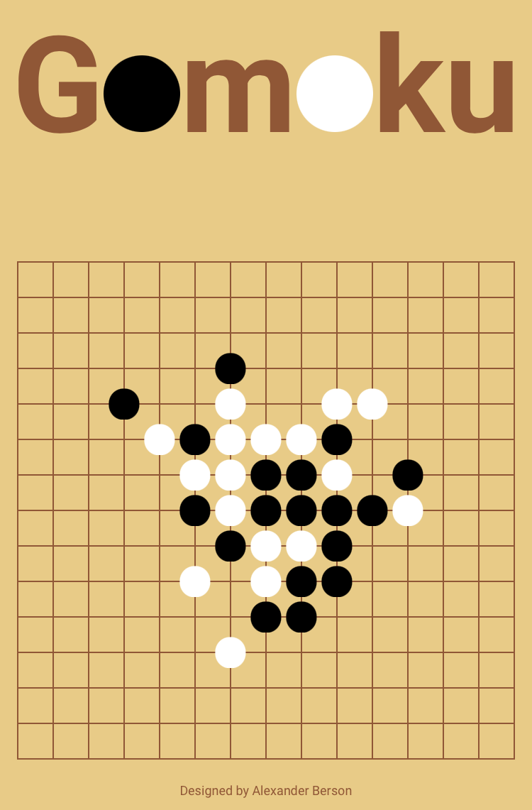

# Gomoku

Be the first to place five of your stones in a row.   
You can [play Gomoku against the AI online](https://alex-berson.github.io/gomoku/) or  

## Description

**Gomoku1**, also known as **Wuziqi2**, **Omok3**, **Caro4**, **Luffarschack5**, or simply **Five in a Row**, is an abstract strategy board game. It is traditionally played with Go pieces (black and white stones) on a 15×15 Go board, although boards of other sizes are also common. In variants like Caro and Luffarschack, the game is usually played on a sheet of squared paper using Xs and Os, similar to Tic-Tac-Toe.

Players alternate turns placing a stone of their color on an empty intersection. Black plays first. The winner is the first player to form an unbroken line of five stones horizontally, vertically, or diagonally. If the board is completely filled and no one has made a line of five stones, the game ends in a draw.

1. Japanese: 五目 (五目並べ), lit. "Five in a Row"   
2. Chinese: 五子棋, lit. "Five Pieces Game"  
3. Korean: 오목, lit. "Five Pieces"    
4. Vietnamese: *Cờ ca-rô*, lit. "Square Game"  
5. Swedish: *Luffarschack*, lit. "Hobo Chess"

## Screenshot

  

## License

Copyright &copy; 2025 Alexander Berson. This project is licensed under the [MIT license](LICENSE.txt "MIT License").

